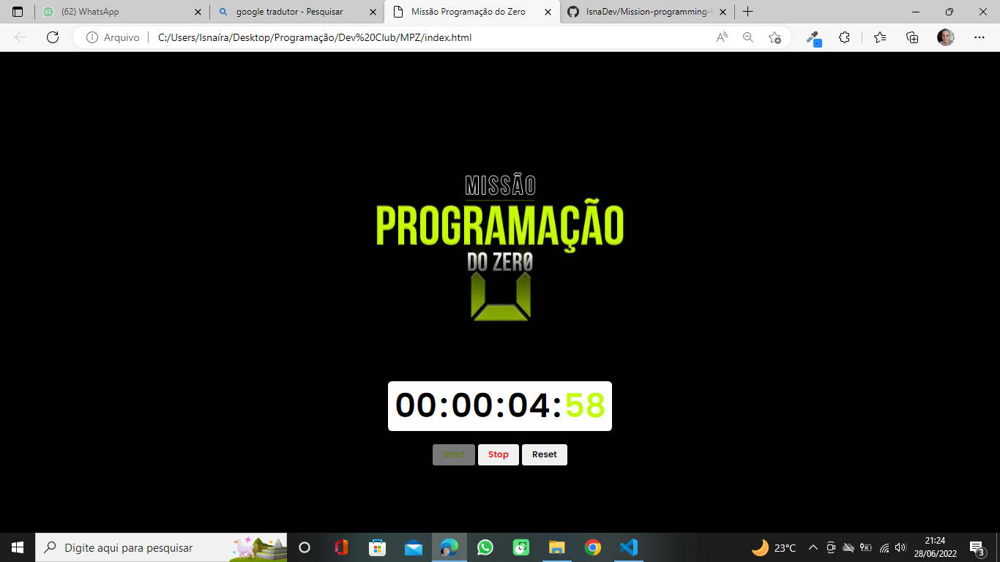

# Mission-programming-from-scratch 
Stopwatch with progressive counting.

 

> Project carried out with HTML, CSS and JavaScript technologies. It is a stopwatch with progressive counting where it has the functions of start, stop and reset.

## 🤝👩🏻 Collaborator

<table>
  <tr>
    <td align="center">
      <a href="#">
         
        
          <b>Isnaíra Souza</b>
        
      </a>
    </td>
    
</table>